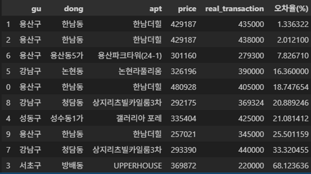

## 아파트 실거매가 예측 프로젝트

### 프로젝트 개요

서울 지역 아파트의 입지 정보(어린이집, 공원, 지하철, 한강 등)와 단지 특성을 바탕으로 실거래가를 예측하는 회귀 모델로 예측하는 프로젝트입니다.
다양한 거리 기반 변수와 인프라 점수를 반영하여 아파트 가격에 어떻게 영향을 미치는지 분석하고, 예측 정확도를 향상시키는 것이 목표입니다.

---

### 데이터
* **데이콘 데이터**
    * train 데이터: `train.csv`
    * test 데이터: `test.csv`
    * 어린이집 위치 데이터: `day_care_center.csv`
    * 공원 위치 데이터: `park.csv`
* **추가 데이터**
    * 지하철 역 위치 (`Seoul_subway_stations.csv`)
    * 한강공원 (`river_park.csv`)
    * 행정구 주소 매핑용 (`address.csv`)

---

### 전처리 과정

1. **불필요한 컬럼 제거**
   * 예: `jibun`, `addr_kr`, `lat`, `lng`, `transaction_date` 등
2. **거리 기반 변수 생성**
   * 어린이집, 공원, 한강공원, 지하철역과의 거리 계산
   * 반경 100m\~1000m 내 지하철 개수
3. **인프라 점수 계산**
   * 거리 데이터를 표준화 후 가운치 적용하여 `infra` 변수 생성
4. **Label Encoding**
   * `city`, `apt`, `gu` 여부 적용
5. **타객 변수 설정**
   * `transaction_real_price` (실거래가)

---

### 모델마다 보고서

* **메인 모델**: `Random Forest Regressor`

* **비교 모델**:
  * `Linear Regression`
  * `XGBoost Regressor`
  * `LightGBM Regressor`

* **성능 (예: Random Forest 기준)**:
  * MAE :  2,088.38
  * RMSE: 4,476.60
  * R²   : 0.9825

---

### 예측 결과

* `test.csv`에 대해 실거래 가 예측 수행

---

### 예측 정확도

* 실거래 데이터와 비교하여 오차율 계산 (MAPE)
* **평균 오차율 (MAPE)**: `21.52%`

---

### 주요 인상과 결과

* `gu(구)` 와 `한강거리`, `면적` 이 예측에 가장 큰 영향
* 가치에 영향을 미치는 인프라, 공원, 어린이집, 지하철 거리 값도 영향이 있어보임

---

